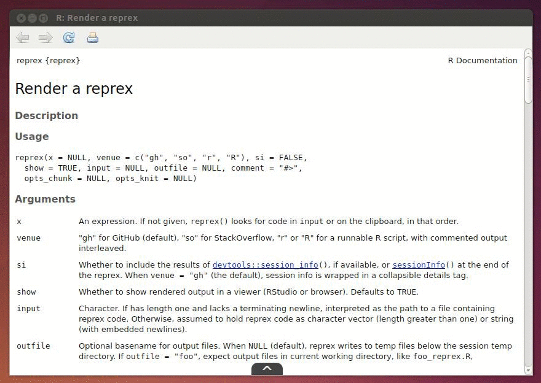

# btts :: We need to go... Back To The Source


[](https://cran.r-project.org/package=btts)

The goal of `btts` is to create a stronger link between the active user and the 
source files for a package. Too often I find myself searching through GitHub to 
find where I loaded a package from, or in which file a function is defined. Now, 
that information is just a click away.

GitHub has become the de-facto development repository for R packages, so it's 
essential that we are able to file issues, report bugs, suggest features, and 
generally interact with the source of a package. While other VCS platforms exist
and are used, for now I am only supporting GitHub as I am most familiar with it.
In theory this can be extended to BitBucket and others too.

## Installation

```devtools::install_github("jonocarroll/btts") ```

Note that this package is unable to self-document using this method as it would 
need to unload itself first.

It is advisable to install a package for the first time using 
`devtools::install_github` so that dependencies are properly met. The 
additional functionality can then be added by re-installing with
`btts::install_github`.

## Motivation

The motivation for this package is similar to that of `pryr::show_c_source` 
which obtains the `C` code for an `R` `.Primitive`. Often we need to see the raw
source of a function definition, so this package allows us to easily link back 
to the GitHub repo where it is hosted.

## Usage

Starting with a fresh session (in RStudio, <kbd>CTRL</kbd>+<kbd>F10</kbd> or 
<kbd>CMD</kbd>+<kbd>F10</kbd>),

`btts::install_github("owner/package")`

fetches an `R` package source from GitHub (exactly the same as 
`devtools::install_github("owner/package")` does) then injects some HTML into 
the Roxygen comments to add to the help overlay. It then builds the package as 
normal.

If a package is available on 
[CRAN](https://cran.r-project.org/web/packages/available_packages_by_name.html) 
but not on GitHub, then this menu can still be added by installing from [the 
read-only CRAN mirror](https://github.com/cran/), e.g.

`btts::install_github("cran/ggghost")`

but the Issues link will be somewhat useless as this is not where issues are 
maintained.

Once installed and loaded the usual way (`library(package)`) the help pane in 
RStudio for that package's functions will now feature a pull-up tab at the 
bottom. In that tab are links to the repo itself, the issues page, and the 
source file for the function in question.



## Acknowledgements

Noam Ross created [htmlhelp](https://github.com/noamross/htmlhelp) which I 
adapted into this form. This would not have been possible without his first 
steps.

